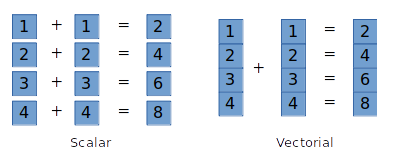

# C SIMD Example with AVX2

## Compilation

```sh
gcc -mavx2 main.c -o output
```

## Example

```c
__m256i first = _mm256_set_epi32(10, 20, 30, 40, 50, 60, 70, 80);
__m256i second = _mm256_set_epi32(5, 5, 5, 5, 5, 5, 5, 5);
__m256i result = _mm256_add_epi32(first, second);

int* values = (int*) &result;
```

## Scalar VS Vectorial



SIMD solves the problem to execute many times the same instruction on a lot of data.
If the operation is always the same, and the data always have the same data type,
then using SIMD is more efficient.

In fact, instead of generating "basic" assembly instructions like multiple `mov` and `add`,
it simply generates a few specific instructions (enough to handle the data),
that are able to map to handle "vectors" in memory (shrunk of data of the same type)
and operate the operation only once on all those data. This is called "vectorization".

Coding using vectorization directly depends of the architecture and the processor.
The example above uses AVX2 from Intel for x86 processors. Instead of creating a for loop
in order to make the addition of every item of the first array with the second one,
we simply make two vectors and execute a simple addition between them.

GPU are more reliable to use vectorization, as they have an architecture made to handle
multiple very repetitive operations (pixels on the screen, points in a 3D space to move...).
CPU are also able to handle vectorization but are not directly made for that.
Of course, using SIMD also increases a lot the execution time as there amount of instructions
to execute might be reduced a lot.

## More about AVX2

 * List of intrinsics: https://software.intel.com/sites/landingpage/IntrinsicsGuide/#expand=91,555&techs=AVX2
 * Simple tutorial: https://www.codeproject.com/Articles/874396/Crunching-Numbers-with-AVX-and-AVX
